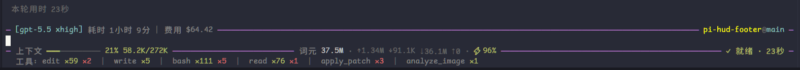
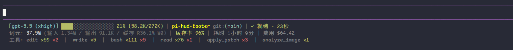

# pi-hud-footer

English | [简体中文](README.md)

A Claude HUD style custom footer/statusline extension for [pi coding agent](https://github.com/earendil-works/pi).

It keeps model, context, token, cache, cost, tool-call, and running-state information visible near the bottom of the TUI. The default `border` style embeds stable HUD information into the input editor borders and leaves only dynamically growing tool statistics in the footer, avoiding footer-height changes while the agent is thinking.

## Highlights

- Shows the current model, thinking level, project name, and git branch
- Shows context usage, token usage, cache read/write tokens, and cache hit rate
- Shows running / ready state, session elapsed time, estimated cost, and turn duration
- Shows tool-call statistics while keeping footer height stable
- Supports two HUD styles: `border` editor-border style and `classic` footer style
- Supports Chinese and English UI text, selected automatically from the system language by default
- Supports global and project-level JSON configuration

## Themes / Styles

| Style | Alias | Best for | Description |
|---|---|---|---|
| `border` | `2` | Recommended default | Embeds model, elapsed time, cost, context usage, token metrics, and state into the input editor borders. Tool statistics stay in the footer line for a more stable layout. |
| `classic` | `1` | Previous layout | Displays HUD information below the input box, suitable for users who prefer the previous three-line footer layout. |

Temporarily switch the style for the current TUI session:

```text
/hud-footer-theme
```

To persist the style, write it to your configuration file:

```json
{
  "style": "border"
}
```

### `border` / `2`: editor-border style



### `classic` / `1`: classic footer style



## Installation

Recommended installation from npm:

```bash
pi install npm:pi-hud-footer
```

You can also install from GitHub without specifying a version:

```bash
pi install git:github.com/liao666brant/pi-hud-footer
```

For local development or debugging, install from a local path:

```bash
pi install /path/to/pi-hud-footer
```

## Commands

| Command | Description |
|---|---|
| `/hud-footer` | Toggle the HUD footer on or off for the current session. |
| `/hud-footer-reload` | Reload configuration and refresh the HUD footer. |
| `/hud-footer-theme` | Open a TUI selector and temporarily switch the current session style. |

## Configuration

Full configuration reference: [docs/CONFIG.en.md](docs/CONFIG.en.md)

Example configuration: [examples/hud-footer.json](examples/hud-footer.json)

| Level | Path | Notes |
|---|---|---|
| Global | `~/.pi/agent/hud-footer.json` | Applies to all sessions. |
| Project | `.pi/hud-footer.json` | Read only when the project is trusted, and overrides global configuration. |

After changing configuration, run this in pi:

```text
/hud-footer-reload
```

Or:

```text
/reload
```

## Metrics

Token metrics use these icons:

| Icon | Meaning |
|---|---|
| `↑` | Input tokens |
| `↓` | Output tokens |
| `⇣` | Cache read tokens |
| `⇡` | Cache write tokens |
| `⚡` | Cache hit rate |

Cache hit rate formula:

```txt
cacheRead / (input + cacheRead + cacheWrite)
```

Meaning: cached input tokens / total input-side tokens.

## Development / temporary loading

Load without installing:

```bash
pi -e ./pi-hud-footer
```

From inside this repository:

```bash
pi -e .
```

After making changes, run this in pi:

```text
/reload
```

## Publishing

See [docs/PUBLISH.en.md](docs/PUBLISH.en.md).

## Security

pi extensions run with your system permissions. This extension only reads session metadata exposed by the pi extension API and git branch information exposed by the pi footer API. It does not access the network.

## License

MIT
